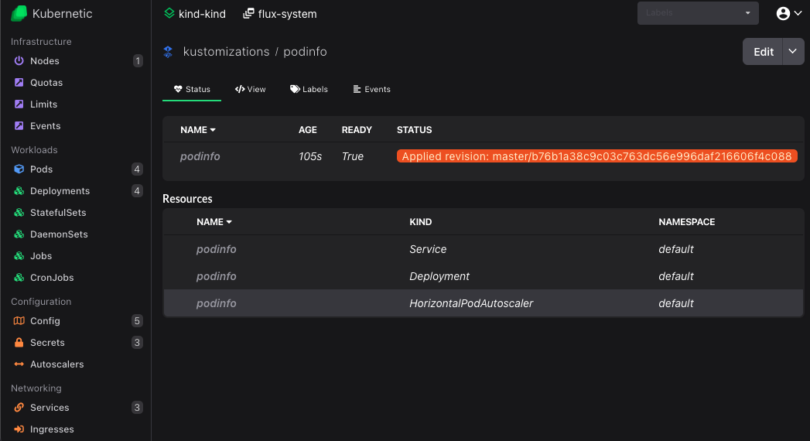

Release v4.3.0 is out with some UI improvements and integration with FluxCD.

### Collapsible Menu Categories

Menu categories can now be collapsed, when collapsed an arrow is displayed to show the collapsed state. The collapsable state is persisted.

CRDs have been moved inside a menu category "Custom Resources" and regrouped under top-level domain groups (e.g. `*.cert-manager.io` instead of `acme.cert-manager.io`) This change effectively groups together all CRDs that are coming from a specific solution.

When hovered on a CRD you can now see the full name along with the group which is now used to uniquely identify the CRD. This fixes an issue with Knative that uses services.serving.knative.dev as CRD name which was previously shadowed by the k8s services as it resolves the ambiguity. You can also now see that the title is displaying the entire name along with the CRD group.

### Favorite Resources

Resources now can be favorited and a `Favorites` category will appear on the side menu.

Favorite resource types can also be accessed directly with keyboard shortcuts `G` + (`1`, `2`, `3`...).

### Pin Namespaces

Namespace on dropdown can now be pinned and it will be unchanged when switching contexts.

This is useful when using same namespaces on different contexts, switching for example between dev staging and production contexts.

### Upgrade to stable Kubernetes APIs

All references to `betav1` APIs have been upgraded to stable `v1` versions. More specifically the following changes are applied:

* ingresses from `extensions/v1beta1` to `networking/v1`
* cronjobs from `batch/v1beta1` to `batch/v1`

### Context Menu on Logs

Logs now have a context menu on mouse right click, which provides all the existing functionality plus the ability to Select All, Copy and Save the logs to a file.context

### Integration with FluxCD

Lastly and more important there is now an integration with FluxCD. You can read more about the integration on a separate blog entry for the FluxCD tutorial [here](/flux-tutorial).

You can now:

* Create GitRepositories
* Create Kustomizations
* Create HelmRepositories
* Create HelmReleases
* View Kustomizations generated resources

